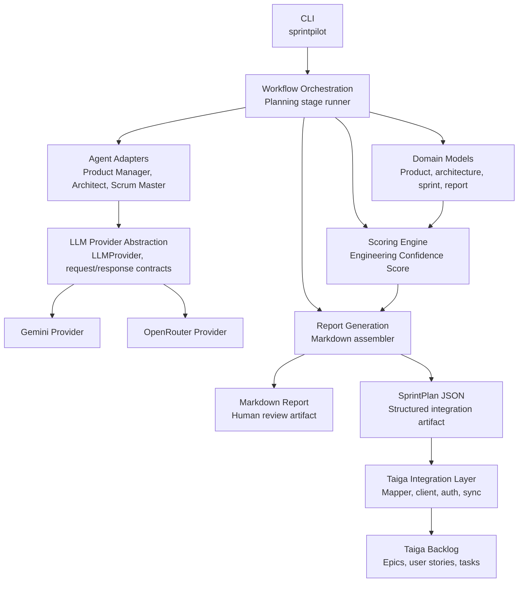

# SprintPilot

SprintPilot is an AI-powered Agile SDLC platform that transforms product ideas into structured engineering artifacts and exports accepted sprint planning output into a Taiga backlog.

The current release combines the Core Planning Engine from v1.0 with the Taiga Backlog Export release from v2.0:

```text
Idea
↓
Product Definition
↓
Architecture Plan
↓
Sprint Plan
↓
Engineering Confidence Score
↓
Markdown Report
↓
SprintPlan JSON
↓
Taiga Backlog
```

It is designed for engineers, student developers, founders and small teams who need to reduce ambiguity before writing code. SprintPilot is not a chatbot, project management clone, autonomous coding agent or ticket tracker replacement.

## Why This Project Matters

Most early software projects fail slowly: requirements are fuzzy, architecture decisions are implicit, sprint scope is guessed and risks are discovered after development starts. SprintPilot moves those conversations earlier by producing reviewable planning artifacts with reasoning, assumptions, missing information and readiness recommendations.

For recruiters and reviewers, SprintPilot demonstrates a complete product-minded engineering slice: domain modeling, provider abstraction, workflow orchestration, deterministic scoring, CLI ergonomics, Markdown report generation, structured artifact generation, external integration boundaries and broad automated test coverage.

## Current Release Highlights

- Product Definition
- Architecture Planning
- Sprint Planning
- Engineering Confidence Score with factor-level reasoning
- Markdown report generation
- Structured SprintPlan JSON generation
- Taiga backlog export for epics, user stories and tasks
- Dry-run export before live Taiga writes
- Live export after human review
- Profile-based Taiga configuration with secrets kept outside source control
- Provider-agnostic LLM architecture
- Gemini integration
- CLI-first local workflow
- 189+ automated tests covering domain logic, provider contracts, workflow behavior, scoring, reporting, CLI paths and Taiga integration behavior

## Core Workflow

1. **Product Definition**: Converts an idea into a product summary, users, requirements, user stories, acceptance criteria, assumptions, risks and missing information.
2. **Architecture Planning**: Produces advisory architecture guidance, stack categories, components, persistence considerations, tradeoffs, assumptions and open questions.
3. **Sprint Planning**: Builds Agile planning artifacts: epics, sprint-ready stories, task breakdowns, dependencies, story point estimates and estimate reasoning.
4. **Engineering Confidence Assessment**: Scores implementation readiness across requirement clarity, architecture completeness, dependency readiness, acceptance criteria quality, technical ambiguity and delivery risk.
5. **Markdown Report + SprintPlan Artifact**: Writes the full planning package to a local Markdown report and saves the structured SprintPlan JSON used by integrations.
6. **Taiga Backlog Export**: Converts the SprintPlan JSON artifact into Taiga epics, user stories and tasks for backlog review.

## Architecture Overview

SprintPilot is organized as a modular Python CLI application. Domain logic, workflow orchestration, provider access, scoring, validation, reporting and integrations are kept behind explicit package boundaries.



Diagram source: [docs/images/core-v1-architecture.mmd](docs/images/core-v1-architecture.mmd)

## Provider Abstraction

SprintPilot code outside `sprintpilot.llm` depends on provider-neutral contracts:

- `LLMProvider`: common interface for prompt execution and structured generation.
- `LLMRequest`: provider-independent messages, model override, temperature, max tokens and response schema.
- `LLMResponse`: normalized content, model name, finish reason, token usage and metadata.
- `StructuredGenerationResult`: parsed JSON data plus validation errors.
- Provider factory: resolves the configured provider from runtime settings.

This keeps workflow, scoring, validation, reporting, integrations and domain logic independent from provider SDKs. Gemini-specific behavior lives in `src/sprintpilot/llm/providers/gemini.py`.

The Taiga integration is isolated under `src/sprintpilot/integrations/taiga/` so backlog export does not leak into LLM providers, scoring, report assembly or Core Planning Engine behavior.

## Installation

Use Python 3.12 or newer.

```bash
python -m venv .venv
.venv\Scripts\activate
python -m pip install -e .
```

## Configure Gemini Locally

Create a local `.env` file or export environment variables in your shell:

```bash
SPRINTPILOT_MODEL_PROVIDER=gemini
SPRINTPILOT_MODEL_NAME=gemini-2.5-flash
GEMINI_API_KEY=your_api_key_here
```

`SPRINTPILOT_GEMINI_API_KEY` is also supported. Do not commit real API keys.

## Run The CLI

Generate planning artifacts:

```bash
sprintpilot --idea "Build a student internship tracking platform"
```

You can also use the explicit `plan` subcommand:

```bash
sprintpilot plan --idea "Build a student internship tracking platform"
```

Validate inputs without calling a provider:

```bash
sprintpilot --idea "Build a student internship tracking platform" --dry-run
```

Check provider configuration and structured-output support:

```bash
sprintpilot --diagnostics --verbose
```

Generate artifacts into the `reports/` directory:

```bash
sprintpilot --idea "Build a student internship tracking platform that tracks applications, interviews, offers, deadlines and recruiter contacts." --output reports --title "Student Internship Tracking Platform"
```

The normal planning run writes two files to the report output location:

- `student-internship-tracking-platform.md`: the human-reviewable Markdown report.
- `student-internship-tracking-platform.sprint-plan.json`: the structured SprintPlan artifact that can be passed directly to Taiga export.

When `--output` is a specific Markdown file, the SprintPlan artifact uses the same stem beside it. For example, `reports/internship-report.md` produces `reports/internship-report.sprint-plan.json`.

You can also provide an idea file:

```bash
sprintpilot --idea-file examples\idea.txt --output reports
```

## Export To Taiga Backlog

SprintPilot v2.0 exports the structured SprintPlan JSON artifact to Taiga backlog epics, user stories and tasks. It does not assign sprints, milestones, capacity, velocity or multi-sprint schedules.

Use `taiga-connect` once to configure the Taiga profile:

```bash
sprintpilot taiga-connect \
  --profile acme \
  --base-url https://taiga.example.com \
  --project my-project \
  --auth-mode bearer \
  --token-env-key SPRINTPILOT_TAIGA_TOKEN \
  --default
```

Profiles store non-secret connection data under the user config directory:

- Windows: `%APPDATA%\SprintPilot\taiga-profiles.json`
- macOS/Linux: `$XDG_CONFIG_HOME/sprintpilot/taiga-profiles.json` or `~/.config/sprintpilot/taiga-profiles.json`

The current repo stores only its active profile name in `.sprintpilot/taiga.json`. Token values are not written to either file. Put the token in your shell, OS keyring or an untracked local `.env`:

```bash
SPRINTPILOT_TAIGA_TOKEN=your_taiga_token_here
```

Preview the backlog export without creating items:

```bash
sprintpilot taiga-export --sprint-plan-file reports/<artifact>.sprint-plan.json --dry-run
```

Create Taiga backlog items after reviewing the preview:

```bash
sprintpilot taiga-export --sprint-plan-file reports/<artifact>.sprint-plan.json --live
```

Legacy `SPRINTPILOT_TAIGA_BASE_URL`, `SPRINTPILOT_TAIGA_PROJECT`, `SPRINTPILOT_TAIGA_AUTH_MODE` and `SPRINTPILOT_TAIGA_TOKEN_ENV_KEY` values still work as a fallback, but `.env` is intended for secrets rather than routine Taiga target selection.

## GitHub Hygiene

The repository intentionally keeps generated and local-only files out of source control:

- `.env` and `.env.*` for local credentials and API keys.
- `.venv/`, build outputs, caches and test coverage artifacts.
- `reports/` for generated Markdown reports and SprintPlan JSON artifacts.
- `.sprintpilot/` for repo-local Taiga profile bindings.
- local agent and Spec Kit memory files under `.agents/` and `.specify/memory/`.

Keep `.env.example`, `README.md`, source code, tests, docs and active `specs/` artifacts reviewable in Git.

## Run Tests

```bash
pytest tests/
```

Useful focused checks:

```bash
pytest tests/unit
pytest tests/integration
```

Automated tests use mocked provider and Taiga behavior where needed. They should not require live LLM credentials or live Taiga credentials.

## Sample Output

SprintPilot outputs are intended for human review before implementation.

Current outputs include:

- Markdown planning report
- Structured SprintPlan JSON artifact
- Taiga backlog items for epics, user stories and tasks

Example excerpts:

- [Internship tracker planning report excerpt](docs/examples/internship-tracker-report-excerpt.md)
- [Course planner planning report excerpt](docs/examples/course-planner-report-excerpt.md)

Excerpt preview:

```markdown
## Engineering Confidence Assessment

Overall score: 79/100

- Requirement clarity: 100/100 - Clear requirements, user stories, assumptions and acceptance criteria.
- Architecture completeness: 100/100 - Components, stack categories, data considerations and tradeoffs are defined.
- Dependency readiness: 50/100 - Several open questions still affect implementation readiness.

Recommended actions:
- Prioritize the smallest usable workflow before advanced summaries.
- Resolve privacy and reminder expectations before sprint start.
```

## Included In The Current Scope

- Product Definition
- Architecture Planning
- Sprint Planning
- Engineering Confidence Score
- Markdown report generation
- Structured SprintPlan JSON generation
- CLI-first local execution
- Provider-agnostic LLM architecture
- Gemini integration
- Human-reviewable assumptions, risks, missing information and recommendations
- Taiga backlog export for epics, user stories and tasks
- Dry-run export
- Live export
- Profile-based Taiga configuration
- Conservative duplicate avoidance where SprintPilot can match backlog items safely

## Out Of Scope

- Sprint assignment, milestone assignment, velocity planning and capacity planning
- Multi-sprint scheduling or splitting stories across scheduled containers
- GitHub integration before the dedicated v4.0 scope
- Code generation, scaffolding or autonomous coding
- Repository management
- CI/CD and deployment automation
- Cloud collaboration or multi-user workspaces
- Analytics modules beyond report-level planning context
- Review agents before the dedicated v5.0 scope
- RAG systems
- Project management replacement workflows

## Future Roadmap

SprintPilot now follows a versioned roadmap that separates completed planning work from future delivery surfaces:

- ✅ v1.0 - Core Planning Engine
- ✅ v2.0 - Taiga Backlog Export
- 🚧 v2.1 - Planning Quality Improvements
- 🚧 v3.0 - Frontend Dashboard
- 🚧 v4.0 - GitHub Integration
- 🚧 v5.0 - Multi-Agent Review System

## Repository Layout

```text
src/sprintpilot/
  agents/       Agent prompts, adapters and orchestration boundaries
  domain/       Pydantic models for planning artifacts
  integrations/ External integration boundaries, including Taiga backlog export
  llm/          Provider-neutral contracts and provider implementations
  reporting/    Markdown report assembly and SprintPlan artifact writing
  scoring/      Engineering Confidence Score factors and engine
  validation/   Scope, Agile and artifact validation helpers
  workflow/     Core Planning Engine stage orchestration
  cli.py        Local CLI entrypoint
```

SprintPilot keeps business logic independent from provider SDKs and external integrations, making the project easier to test, review and extend.
