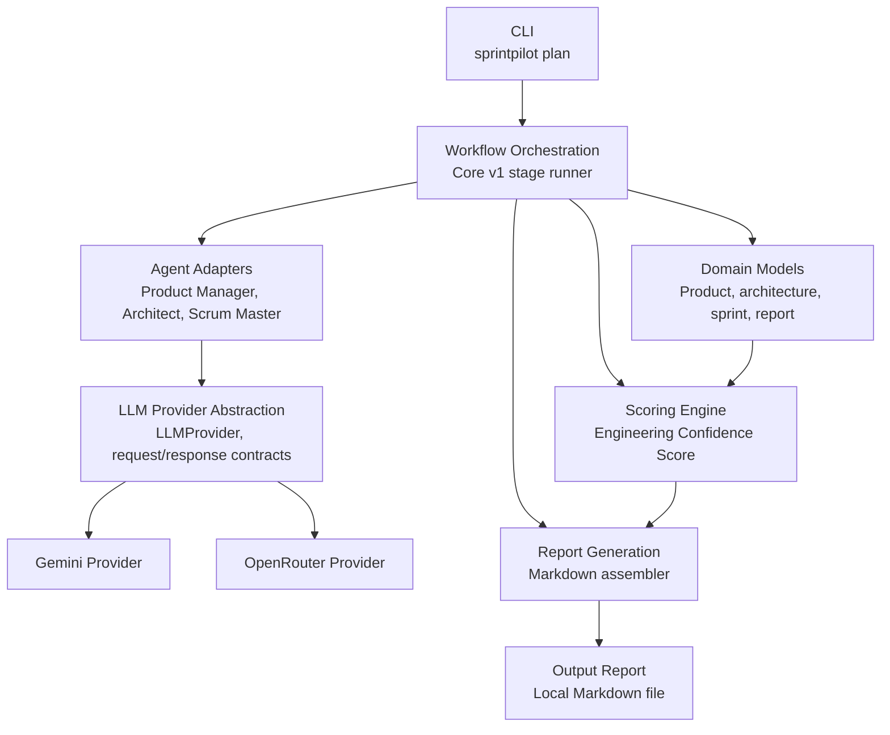

# SprintPilot

SprintPilot is an AI-powered Agile SDLC planning tool that turns a product idea into implementation-ready engineering artifacts.

Core v1 is a local, CLI-first release focused on one practical workflow:

```text
Product Idea -> Product Definition -> Architecture Plan -> Sprint Plan -> Engineering Confidence Assessment -> Markdown Report
```

It is designed for engineers, student developers, founders and small teams who need to reduce ambiguity before writing code. SprintPilot is not a chatbot, project management clone, autonomous coding agent or ticket tracker replacement.

## Why This Project Matters

Most early software projects fail slowly: requirements are fuzzy, architecture decisions are implicit, sprint scope is guessed and risks are discovered after development starts. SprintPilot moves those conversations earlier by producing reviewable planning artifacts with reasoning, assumptions, missing information and readiness recommendations.

For recruiters and reviewers, Core v1 demonstrates a complete product-minded engineering slice: domain modeling, provider abstraction, workflow orchestration, deterministic scoring, CLI ergonomics, Markdown report generation and broad automated test coverage.

## Core v1 Highlights

- Provider-agnostic LLM interface with Gemini and OpenRouter implementations.
- End-to-end planning workflow from product idea to local Markdown report.
- Structured domain models for product, architecture, sprint planning, confidence scoring and reports.
- Deterministic Engineering Confidence Score with factor-level reasoning.
- Human-reviewable assumptions, risks, missing information and recommendations.
- CLI-first local workflow with dry-run and provider diagnostics commands.
- Scope boundaries that keep Core v1 focused on planning, not code generation or external integrations.
- 120+ automated tests covering domain logic, provider contracts, workflow behavior, scoring, reporting and CLI paths.

## Core v1 Workflow

1. **Product Definition**: Converts an idea into a product summary, users, requirements, user stories, acceptance criteria, assumptions, risks and missing information.
2. **Architecture Planning**: Produces advisory architecture guidance, stack categories, components, persistence considerations, tradeoffs, assumptions and open questions.
3. **Sprint Planning**: Builds Agile planning artifacts: epics, sprint-ready stories, task breakdowns, dependencies, story point estimates and estimate reasoning.
4. **Engineering Confidence Assessment**: Scores implementation readiness across requirement clarity, architecture completeness, dependency readiness, acceptance criteria quality, technical ambiguity and delivery risk.
5. **Markdown Report**: Writes the full planning package to a local report for review and handoff.

## Architecture Overview

SprintPilot Core v1 is organized as a modular Python CLI application. Domain logic, workflow orchestration, provider access, scoring, validation and reporting are kept behind explicit package boundaries.



Diagram source: [docs/images/core-v1-architecture.mmd](docs/images/core-v1-architecture.mmd)

## Provider Abstraction

SprintPilot code outside `sprintpilot.llm` depends on provider-neutral contracts:

- `LLMProvider`: common interface for prompt execution and structured generation.
- `LLMRequest`: provider-independent messages, model override, temperature, max tokens and response schema.
- `LLMResponse`: normalized content, model name, finish reason, token usage and metadata.
- `StructuredGenerationResult`: parsed JSON data plus validation errors.
- Provider factory: resolves the single configured Core v1 provider from runtime settings.

This keeps workflow, scoring, validation, reporting and domain logic independent from provider SDKs. Gemini-specific behavior lives in `src/sprintpilot/llm/providers/gemini.py`.

## Installation

Use Python 3.12 or newer.

```bash
python -m venv .venv
.venv\Scripts\activate
python -m pip install -e .
```

## Configure Gemini Locally

Create a local `.env` file or export environment variables in your shell:

```bash
SPRINTPILOT_MODEL_PROVIDER=gemini
SPRINTPILOT_MODEL_NAME=gemini-2.5-flash
GEMINI_API_KEY=your_api_key_here
```

`SPRINTPILOT_GEMINI_API_KEY` is also supported. Do not commit real API keys.

## Run The CLI

Validate inputs without calling a provider:

```bash
sprintpilot plan --idea "Build a student internship tracking platform" --dry-run
```

Check provider configuration and structured-output support:

```bash
sprintpilot --diagnostics --verbose
```

Generate a Markdown report:

```bash
sprintpilot plan ^
  --idea "Build a student internship tracking platform that tracks applications, interviews, offers, deadlines and recruiter contacts." ^
  --output reports ^
  --title "Student Internship Tracking Platform"
```

You can also provide an idea file:

```bash
sprintpilot plan --idea-file examples\idea.txt --output reports
```

## Run Tests

```bash
pytest tests/
```

Useful focused checks:

```bash
pytest tests/unit
pytest tests/integration
```

Automated tests use mocked provider behavior where needed and should not require live LLM credentials.

## Sample Output

SprintPilot reports are Markdown files intended for human review before implementation.

Example excerpts:

- [Internship tracker planning report excerpt](docs/examples/internship-tracker-report-excerpt.md)
- [Course planner planning report excerpt](docs/examples/course-planner-report-excerpt.md)

Excerpt preview:

```markdown
## Engineering Confidence Assessment

Overall score: 79/100

- Requirement clarity: 100/100 - Clear requirements, user stories, assumptions and acceptance criteria.
- Architecture completeness: 100/100 - Components, stack categories, data considerations and tradeoffs are defined.
- Dependency readiness: 50/100 - Several open questions still affect implementation readiness.

Recommended actions:
- Prioritize the smallest usable workflow before advanced summaries.
- Resolve privacy and reminder expectations before sprint start.
```

## Included In Core v1

- Product idea intake
- Product definition artifacts
- Architecture planning guidance
- Sprint planning artifacts
- Engineering Confidence Score
- Markdown report generation
- CLI-first local execution
- Provider-agnostic LLM abstraction
- Gemini provider support
- Human-reviewable assumptions, risks, missing information and recommendations

## Out Of Scope For Core v1

- GitHub or Taiga integration
- Code generation, scaffolding or autonomous coding
- Repository management
- CI/CD and deployment automation
- Cloud collaboration or multi-user workspaces
- Analytics modules beyond report-level planning context
- Review agents
- RAG systems
- Project management replacement workflows

## Future Roadmap

The next roadmap version is expected to build on Core v1 with integration-ready extension points while preserving the same product boundaries: SprintPilot assists engineering planning and decision-making before implementation begins.

Likely future directions:

- **Core v1.1**: Stronger sample artifacts, packaging polish and CLI usability refinements.
- **v2 planning**: Optional integrations such as Taiga or GitHub once they are explicitly specified.
- **Later modules**: Review agents, analytics, cloud collaboration and code scaffolding only after dedicated specifications define their scope and approval gates.

## Repository Layout

```text
src/sprintpilot/
  agents/       Agent prompts, adapters and orchestration boundaries
  domain/       Pydantic models for Core v1 artifacts
  llm/          Provider-neutral contracts and provider implementations
  reporting/    Markdown report assembly and writing
  scoring/      Engineering Confidence Score factors and engine
  validation/   Scope, Agile and artifact validation helpers
  workflow/     Core v1 stage orchestration
  cli.py        Local CLI entrypoint
```

SprintPilot Core v1 keeps business logic independent from provider SDKs and future integrations, making the project easier to test, review and extend.
